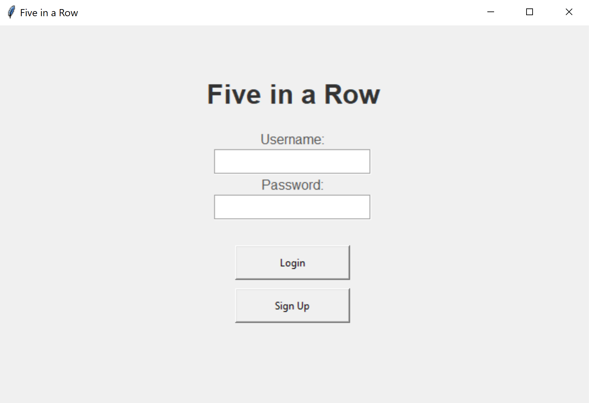
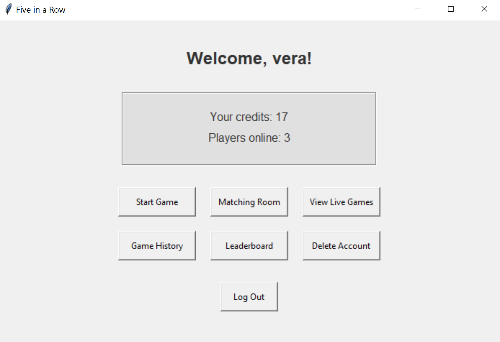
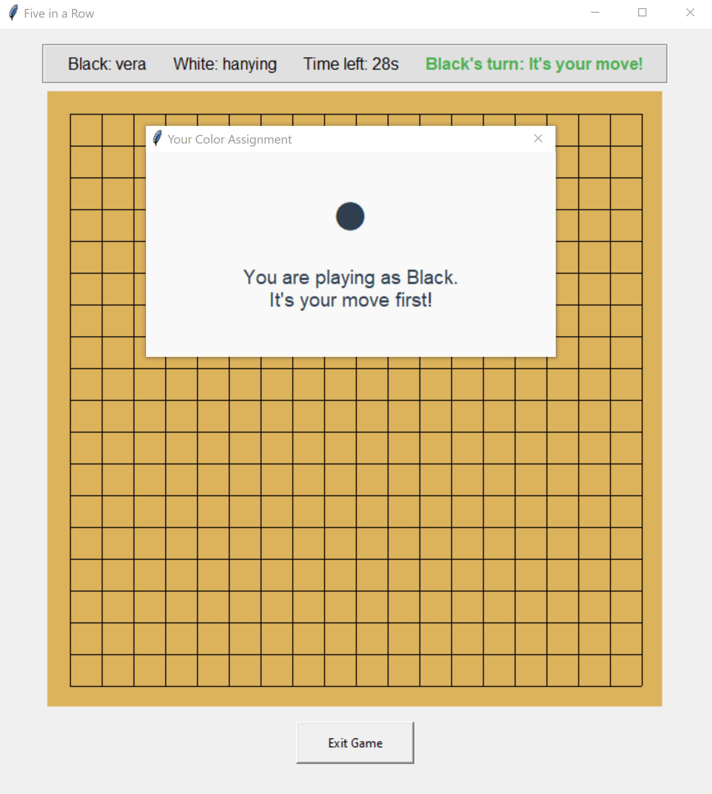
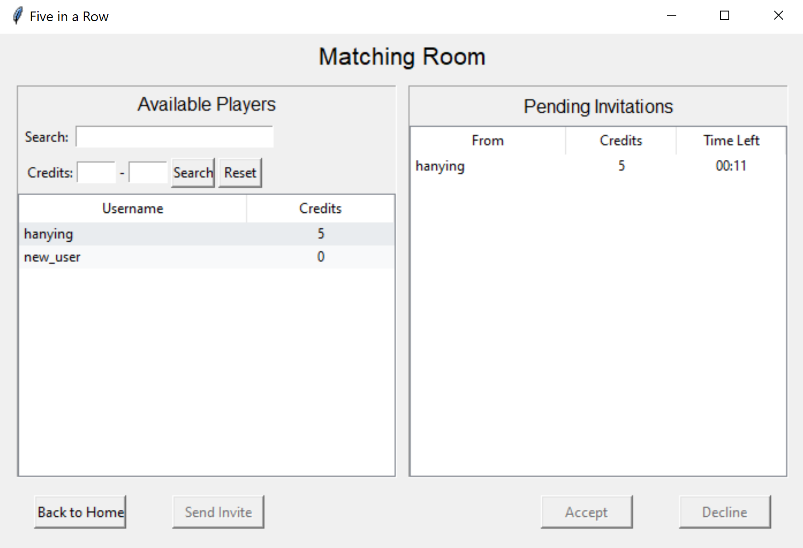
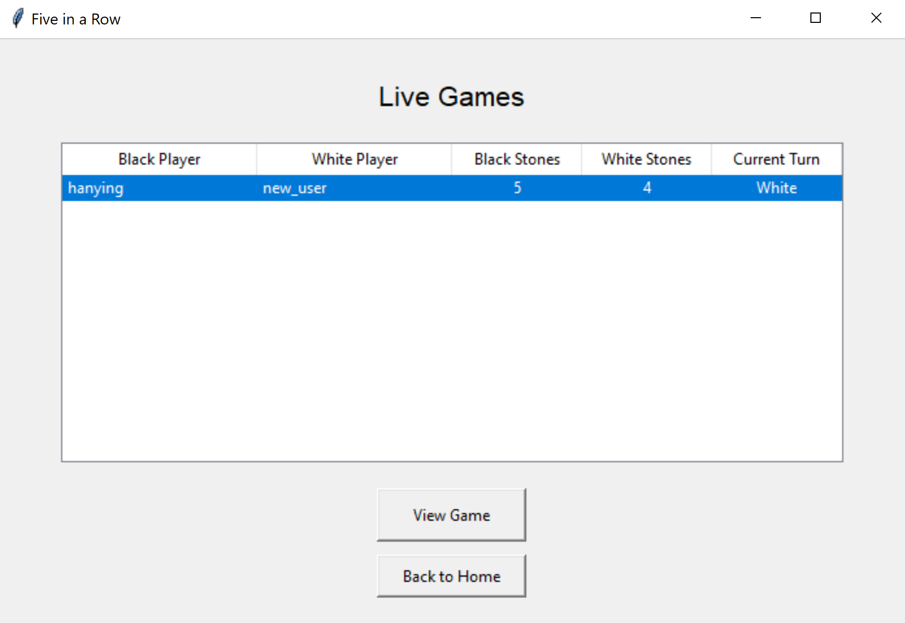
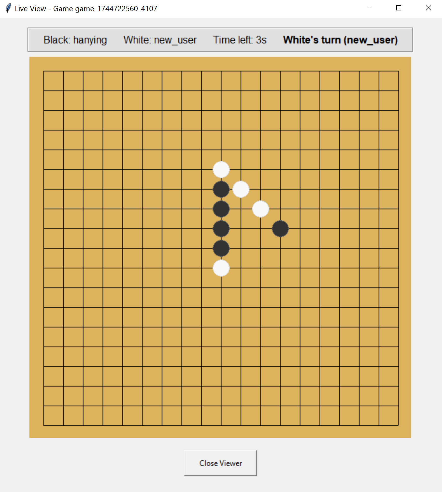
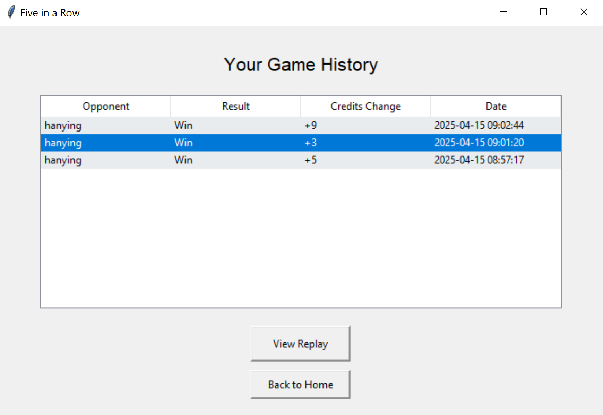
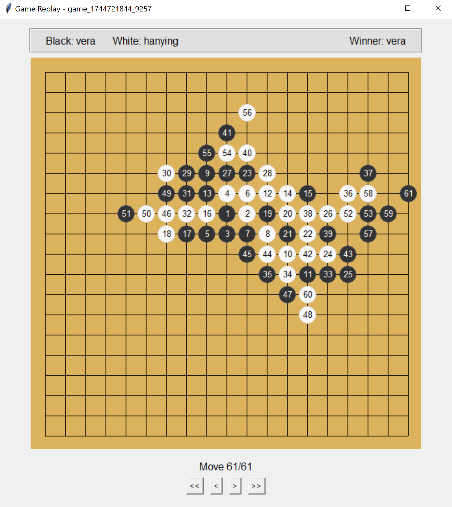
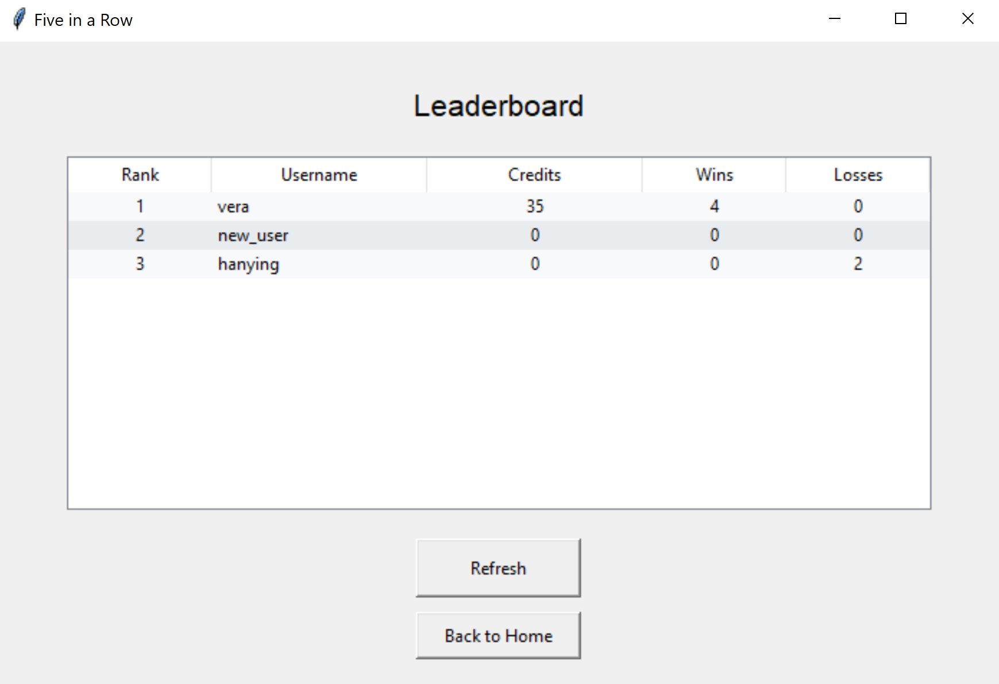
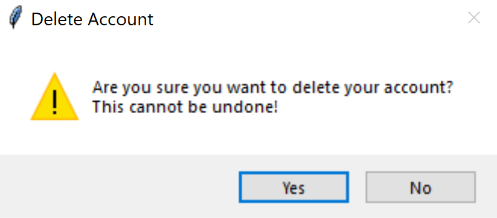

# CS 262 Final Project - A Distributed Multiplayer System for Five-in-a-row
Hanying Feng and Vera Yang

## Introduction

Five-in-a-Row, also called Gomoku, is a classic strategy board game where two players compete to place five of their stones in a consecutive row (horizontally, vertically, or diagonally) on a 19x19 grid. This project builds a distributed multiplayer system for playing Five-in-a-Row online, featuring:

- User authentication (login/signup)
- Real-time gameplay with turn timers
- Player statistics and leaderboards
- Game history and replays
- Live game viewer mode
- Matching room for player searching, game invites, and private matching
- User account management
- Credit-based ranking system

## Prerequisites

- Python 3.7+

## Installation and Running

### 1. Clone or Download the Project Files
   - `client.py` - The game client
   - `server.py` - The game server 
   - `shared.py` - Shared data structures and protocol
   - `config.ini` - Configuration file

To run the system, make sure the server machine has files `server.py`, `shared.py`, and `config.ini`, and the client machines hvae files `client.py`, `shared.py`, and `config.ini`. 

### 2. Modify the Config File
Under the `server` sevtion in `config.ini`, replace the `host` and `port` with your server host and port. Example:
```sh
[server]
host = 127.0.0.1
port = 5555
```

### 3. Start the Server
Start the server by running the following line in your terminal:
```sh
python server.py
```

### 4. Start the Client(s)
Start the client by running the following line in your terminal: 
```sh
python client.py
```
You can also start multiple clients on the same machine, each in a separate terminal. 


## File Structure
```sh
.
├── client.py
├── server.py
├── shared.py
├── config.ini
├── test.py
```

### `client.py`
- The client application with GUI (using tkinter)
- Handles all user interfaces, including authentication, game board and timer, game history replay, live gaming viewing, matching room searching and invitations, and account management.
- Communicates with server via TCP sockets and a JSON wire protocol
- Implements strong error handling for game logic and user inputs

### `server.py`
- The game server for handling client requests and maintains data storage
- Manages user authentication and account management 
- Handles game state, rules enforcement, turn timer, and win/loss determinatinon during game play
- Processes matching invites and acceptance
- Maintains player statistics, game history, and leaderboards
- Uses JSON over TCP for client communication

### `shared.py`
- Shared definitions for client and server 
- Contains shared data classes (User, GameState, GameHistory)
- Defines the JSON message protocol and types of messages (MessageType enum)
- Maintains shared constants

### `config.ini`
Stores server configuration and other information including data files, board size, and timeout for each turn. Allows flexibility for game configurations. 

### `test.py`
- Contains unit tests for the client-server interaction using Python's unittest module
- Tests server creation, client creation, client-server communication, user signup and authentication, game start, live game viewing, game histry extraction and replay, matching room user list, matching room game invites and acceptance, leaderboard stats, and account management.

## User Guide and Walkthrough
### 1. Authentication
<div align="center">

</div>

- Sign Up:
If you have not signed up before, click "Sign Up" and enter your username and password to create an account. Note that username should not contain spaces or newline characters. After signing up, you will be brought to the login screen to authenticate.

- Login:
After signing up or if you already have an account, enter your username and password to login. Click "Login" to authenticate.

### 2. Homepage
<div align="center">

</div>

- After successful login, you'll see the home screen. 
- The homepage shows your current game credits and the number of players online. 

- Main options on homepage:
    - Start Game: Join the matchmaking queue and start a game with another online player.
    - Matching Room: View/search for other players wishing to match, send and receive game invites.
    - View Live Games: Watch ongoing games between other players.
    - Game History: Review your past game history and credit changes. View replays of past games.
    - Leaderboard: View player ranking by game credits.
    - Delete Account: Permanently remove your account.
    - Log Out: Log out of your account.

### 3. Start Game and Gameplay
<div align="center">

</div>

- Starting a Game:
Click "Start Game" on homepage to join the public queue. A waiting message will appear if no other players are in the queue. Otherwise, you will be matched immediately with another online player in the queue. 

- During the game:
    - You will be randomly assinged a stone color, and note that the black stone plays first. 
    - Top panel shows player names, their stone colors, and the current turn. 
    - Players are required to finish a turn in 30 seconds. The timer on the top shows the time left for the current turn. If you do not place a stone in 30 seconds, the system will randomly place a stone for you. 
    - Click "Exit Game" button to forfeit. This will count you as loss. 
    - After the game ends, you will see your win/loss results and credit changes. 

### 4. Matching Room
<div align="center">

</div>

- Click "Matching Room" on homepage to enter the matching room. 
- View or search for players in the matching room:
    - The left panel will show available players in the matching room and their game credits.
    - Search for a specific user using the search bar if you know their usernames.
    - You can also filter users within a specific game credit range.
    - Clear search criteria by clicking "Reset".
- Sending game invites:
    - Click on a user in the list and click "Send Invite" to send a game invite.
    - You will see a waiting for response message after sending the invite. All game invites are valid for 15 seconds.
- Receiving and /declining game invites:
    - All invites you receive will appear on the right panel under "Pending Invitations". 
    - Invites show a countdown and will timeout after 15 seconds. Expired invites will be automatically removed.
    - Click on an invite and click "Accept" to accept the invite. You will enter the game immediately. 
    - Click on an invite and click "Decline" to decline the invite.

### 5. View Live Games
<div align="center">

</div>

- Click "View Live Games" on homepage to see the list of ongoing games. 
- Select a game and click "View Game" to enter the live game viewer mode. 

<div align="center">

</div>

- As a viewer you can see the live game board, who the players are, their stone colors, and the turn timer. 
- Click "Close Viewer" to exit the current viewer. 

### 6. User Statistics and Game History Replay
<div align="center">

</div>

- Click "Game History" on homepage to see your past game history. You can see who the opponent was, game results, credit changes, and the date and time of the game.
- Select a past game and click "View Replay" to replay the seleted game.

<div align="center">

</div>

- The game replay mode allows you to watch a past game move-by-move:
    - Step through moves forward/backward by clicking ">/<".
    - Or, view an auto-replay by clicking ">>/<<".
    - The game moves are numbered to reflect their order of placement.

### 7. Leaderboard
<div align="center">

</div>

- Click "Leaderboard" on homepage to see the current leaderboard, which includes the top 100 players ranked by their game credits and number of wins.

### 8. Account Management
- Click "Delete Account" on homescreen to delete your account.
- A prompt will ask you to confirm deletion. After deleting your account, your data will be permanently removed. Your username will show as "account deleted" on other players' game history. 
<div align="center">

</div>

- After deleting your account, you will be redirected to the login screen.

### 9. Game Credit Calculation
- At the end of a game, game credit changes are calculated. The winner has their game credits incremeted while the loser has their game credits deducted. 
- You have a starting and minimum game credit 0.
- Credit changes consider the following factors:
    - Opponent skill difference: Reward is reduced if the higher-credit player wins to refelct an expected outcome, and reward is increased if the lower-credit player wins to reflect an upset. 
    - Average player credits: Credit changes are in general larger for games between high-credit players.
    - Game length: Shorter games lead to higher rewards for the winner to incentivize efficient stone placement.
- Winner will have an ending credit balance that equals their original balance plus the credit change. Loser will have an ending credit balance that equals their original balance minus the credit change, or 0, whichever is greater.


